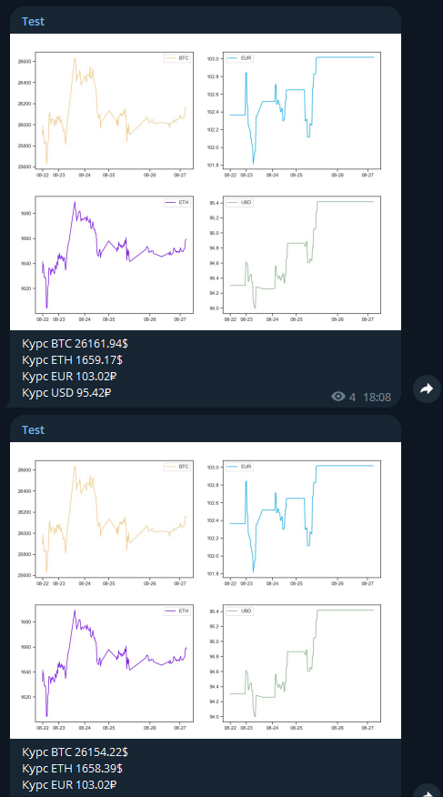

# Бот курсов валют

Телеграм бот, который присылает в канал курсы Биткоина, Эфира, Доллара и Евро.
Биткоин и Эфир выводятся в долларах, доллар и евро в рублях. 
Вывод данных каждые пол часа. Вывод графиков за 5 дней. 
Курсы доллара и евро берутся с сайта Рамблер, биткоина и эфира -
с Бинанса напрямую(через API). Графики валют строятся по данным с
Московской биржи, она работает с 10 до 19, сб и вскр - выходные, 
поэтому данные в нерабочее время отсутствуют.

Для запуска требуется создать файл tokens.env в директории с программой.
Токен бинанса записывается в переменные API_KEY и API_SECRET, токен телеграма
записывается в переменную bot. Далее - создаём канал для постов от бота, 
заменяем название канал на своё в функции TGbot.send_photo. Далее -
запускаем main.

